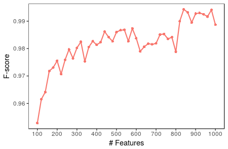

##Our goal:
The goal of this research is to construct a model that can accurately predict the helpfulness of game reviews. We can define our problem as follows:

> Given a set of reviews, determine whether the reviews are helpful or not on the basis of review data, reviewer expertise and game information of those reviews.

##Source code explanation:
* __feature_ranking.R:__ Models with a large number of features may cause issues, as irrelevant features may cause confusion, or unimportant features may increase the execution cost. Thus, we needed to select a proper subset of features, and that is why we should rank the features in our dataset by their importance. In this step, we employed the Random Forest algorithm as the Recursive Feature Elimination technique to output a sorted list of features by their importance. To rank the features, we employed 10-fold cross validation taking a (random) sample size 25%. We repeated the whole process 10 times and finally calculated the mean weight of each feature to rank them.

* __gbm_eval.R:__ In our experiment, we employed a GBM (Gradient Boosting Machine) classifier for model training and evaluation. Before applying GBM to train the model, we investigated our dataset and found it imbalanced. To combat this imbalanced dataset, we applied a number of options discussed step by step in later sections.
 
* __gbm_nullModel.R:__ For binary classification null model is built to compare the model performance. In our experiment, we to build up a null model we predict all observation to majority class.

##Model training and evaluation:
```{r setup, include = FALSE}
#Installing and loading required packages

list.of.packages <- c("caret", "data.table","parallel","doMC", "gbm", "e1071", "xgboost", "ROCR", "pROC", "ROSE", "plyr", "binom", "rmarkdown", "knitr")
new.packages <- list.of.packages[!(list.of.packages %in% installed.packages()[,"Package"])]
if(length(new.packages)) install.packages(new.packages, repos="http://cran.rstudio.com/")

library(data.table)
library(parallel)
library(caret)
library(doMC)
library(gbm)
library(e1071)
library(xgboost)
library(ROCR)
library(pROC)
#library(DMwR)
library(ROSE)
library(plyr)
library(binom)
library(rmarkdown)
library(knitr)
```


```{r, echo = FALSE}
#Set path
path = "~/PredictingReviewHelpfulness/"
setwd(path)
```

```{r, echo = FALSE}
#Model Evaluation function
get_eval_score = function(model.fit, trainX, trainY, testX, testY, score, method){
  
  positiveClass <- ifelse(score %in% c(0.05, 0.10), "No", "Yes")
  
  #Evaluation on Training Data
  #train.pred <- predict(model.fit, trainX)
  train.pred <- predict(model.fit, type = "raw")
  train.ref <- trainY#dataTrain$helpful
  train.confMatrx <- confusionMatrix(data=train.pred, reference=train.ref, positive=positiveClass, mode = "everything")
  train.precision <- train.confMatrx$byClass[["Precision"]]
  train.recall <- train.confMatrx$byClass[["Recall"]]
  train.sensitivity <- train.confMatrx$byClass[["Sensitivity"]]
  train.specificity <- train.confMatrx$byClass[["Specificity"]]
  train.accuracy <- train.confMatrx$overall[["Accuracy"]]
  train.f1score <- train.confMatrx$byClass[["F1"]]
  
  
  #Training AUC
  train.pred.prob <- predict(model.fit, type = "prob")
  pred_vector <- train.pred.prob$Yes
  if(positiveClass == "No")
    pred_vector <- train.pred.prob$No
  ref_vector <- as.factor(ifelse(train.ref == positiveClass, 1, 0)) #make numeric
  auc.pred <- prediction(predictions = pred_vector, labels = ref_vector)
  auc.tmp <- performance(auc.pred,"auc");
  train.auc <- as.numeric(auc.tmp@y.values)
  
  #Evaluation on Test Data
  test.pred <- predict(model.fit, testX)
  test.ref <- testY#dataTest$helpful
  test.confMatrx <- confusionMatrix(data=test.pred, reference=test.ref, positive=positiveClass, mode = "everything")
  test.precision <- test.confMatrx$byClass[["Precision"]]
  test.recall <- test.confMatrx$byClass[["Recall"]]
  test.sensitivity <- test.confMatrx$byClass[["Sensitivity"]]
  test.specificity <- test.confMatrx$byClass[["Specificity"]]
  test.accuracy <- test.confMatrx$overall[["Accuracy"]]
  test.f1score <- test.confMatrx$byClass[["F1"]]
  #cat("\n\tF1score: ", test.f1score)
  
  #Test AUC
  test.pred.prob <- predict(model.fit, testX, type = "prob")
  pred_vector <- test.pred.prob$Yes
  if(positiveClass == "No")
    pred_vector <- test.pred.prob$No
  ref_vector <- as.numeric(ifelse(test.ref == positiveClass, 1, 0)) #make numeric
  auc.pred <- prediction(predictions = pred_vector, labels = ref_vector)
  auc.tmp <- performance(auc.pred,"auc");
  test.auc <- as.numeric(auc.tmp@y.values)
  
  return(list(train.precision=train.precision, 
                    train.recall=train.recall, 
                    train.sensitivity=train.sensitivity, 
                    train.specificity=train.specificity, 
                    train.accuracy=train.accuracy, 
                    train.f1score=train.f1score, 
                    train.auc=train.auc, 
                    test.precision=test.precision, 
                    test.recall=test.recall, 
                    test.sensitivity=test.sensitivity, 
                    test.specificity=test.specificity, 
                    test.accuracy=test.accuracy, 
                    test.f1score=test.f1score, 
                    test.auc=test.auc,
                    method=method))
}
```

On the steam store there are many game genres e.g. action, racing, survival, rpg etc. In this case, we are investigating the helpfulness of Racing game genre. We have considered those reviews which have at least 50 votes.
```{r}
#Define some variables
genre <- "Racing"
vote_num <- 50
```

###1. Loading Dataset
```{r}
#load dataset 
dataFile <- paste0("Dataset/Reviews_", genre ,"_50.Rdata")
if(!file.exists(dataFile) || file.size(dataFile) == 0){
  stop("Data file doesn't exist")
}
load(dataFile)
original_dataset <- ds.reviews
```

###2. Summarize Dataset
Now it is time to take a look at the data
```{r}
# dimensions of dataset
dim(original_dataset)
```
You should see `r nrow(original_dataset)` reviews and `r ncol(original_dataset)` attributes in the original dataset of `r genre` genre.

###3. Add target variable/column
Steam helpfulness (target variable) of a review is defined by the rating score of that review. The rating score of a particular review is computed as the following equation:

$Score = \frac{N_y}{N_p +  N_n}$, where $N_y$ represents the number of people who feel the review is helpful (Yes votes) and $N_n$ represents the number of people feel the review is not helpful (No votes). 

Now depending on a score threshold (0.90) we defined our target variable helpful as follows:
```{r}
##Add a helpful column
score_thrsld <- 0.90
original_dataset$helpful <- ifelse(original_dataset$ws.score > score_thrsld, "Yes", "No")
original_dataset$helpful <- as.factor(original_dataset$helpful)
dim.y <- "helpful"
```

###4. Feature Selection
After doing the feature ranking (Rscript feature_ranking.R), we have total __1789__ features that as shown in the following table. Some insignificant features are removed during the ranking process.

Feature Type    | Examples                    | Explanation
------------    | --------------------------- | -------------------------------------------------------
Metadata (39)   | e.g. recommend, days.interval, #words, #sentences | Text, Reviewer, Game metadata. Counting, Aggregating, Ratio variables  
LIWC (93)       | liwc.* (e.g. liwc.Segment, liwc.WC, liwc.Analytic, liwc.Tone) | Linguistic Inquiry and Word Count (LIWC) reads a given text and counts the percentage of words that reflect different emotions, thinking styles, social concerns, and even parts of speech 
TF-IDF (629)    | tfidf.* (e.g. tfidf.die, tfidf.easy, tfidf.better, tfidf.bad) | Unigram term-weighting method used to extract features based on the word frequencies in the review and review corpus
LDA (28)        | topic.* (e.g. topic.1, topic.2, topic.3) | Topic based features induced from review corpus
Word2Vec (1000) | wv.* (e.g. wv.1, wv.2, wv.3, wv.4) | Word2vec, a group of related models that are used to produce word embeddings features from the text

```{r}
# Load feature file
featureFile <- paste0("Features/FT_", genre, "_V", vote_num, "_R", score_thrsld,"_S25.Rdata")
if(!file.exists(featureFile)){
  stop("\nFeature File Not Exists!!")
}
load(featureFile)

# Total number of features
max.dims <- NROW(feature.rank)
print(max.dims)
```

```{r}
# Total feature list
dim.x <- feature.rank[order(feature.rank$total)[1:max.dims],]$name

# Exclude tfidf features, we found there are not important at all
dim.x <- grep("^tfidf.*?", dim.x, value = TRUE,  invert = TRUE)
dataset <- original_dataset[, c(dim.x, dim.y), with=F]
# Peek at the Data   
head(dataset[,1:5], 5)
```
We did an investigation with a smaller sample size (50% of the dataset) taking the upper limit of feature size by 1000. The results are displayed in the following Figure.


From the above plot of F-score againts number of feature, we can clearly see that the best F-scores of the dataset were found when the number of features were 840.
```{r}
# Select number of features
gbm.dim <- 840
# Selec the best subset of the total features
gbm.dim.x <- dim.x[1:gbm.dim]
```

###5. Balance the dataset
Let’s now take a look at the number of instances (rows) that belong to each class and balance the dataset.
```{r}
# Total number of rows in the dataset
n.rows <- NROW(dataset)
# Class Distribution
print(table(dataset$helpful))
```
Creates possibly balanced samples by random over-sampling minority examples, under-sampling majority examples or combination of over- and under-sampling.
```{r}
# Balance data set with both over and under sampling
n.samplePercent <- 100
n.sampleSize <- ceiling(n.rows * n.samplePercent/100)
balanced_data <- ovun.sample(helpful ~ ., data = dataset, method="both", p=0.5, N=n.sampleSize)$data
print(table(balanced_data$helpful))
```
###6. Partition training and test dataset
Partition dataset into training (80%) and test (20%).
```{r}
# Split dataset
split <- 0.80
trainIndex <- as.vector(createDataPartition(y=balanced_data$helpful, p=split, list=FALSE))

# Get train data
gbm.dataTrain <- balanced_data[trainIndex, c(gbm.dim.x,dim.y), ]
dim(gbm.dataTrain)

# Get test data
gbm.dataTest <- balanced_data[-trainIndex, c(gbm.dim.x,dim.y), ]
dim(gbm.dataTest)

# Split train data
gbm.trainX <- gbm.dataTrain[, gbm.dim.x, ]
gbm.trainY <- as.factor(gbm.dataTrain[, dim.y, ])
        
# Split test data 
gbm.testX <- gbm.dataTest[, gbm.dim.x, ]
gbm.testY <- as.factor(gbm.dataTest[, dim.y, ])
```
### 7. Preprocess data
```{r}
# Remove columns with near zero variance
nearZV <- nearZeroVar(gbm.trainX)
if(length(nearZV) > 0){
    gbm.trainX <- gbm.trainX[, -nearZV]
    gbm.testX <- gbm.testX[, -nearZV]
}

# Preprocess training Data
preObj <- preProcess(gbm.trainX, method = c("center", "scale"))
gbm.trainX <- predict(preObj, gbm.trainX)
        
# Preprocess test Data
preObj <- preProcess(gbm.testX, method = c("center", "scale"))
gbm.testX <- predict(preObj, gbm.testX)
```


###8. Train and build the model
We will apply 10-fold crossvalidation to build the model. In our experiment, we have used more reliable
evaluation metrics: F-score and AUC. We have employed a GBM (Gradient Boosting Machine) classifier.
```{r}
# Control parameters 
gbm.fitControl = trainControl(method="repeatedcv", #small size -> repeatedcv
                              number=10, #10-fold cv
                              repeats=3,
                              returnResamp = "final",
                              selectionFunction = "best",
                              classProbs=TRUE, 
                              summaryFunction=twoClassSummary,
                              allowParallel = TRUE)
# Train the model
gbmFit <- train(gbm.trainX, gbm.trainY, method="gbm", metric="ROC", trControl=gbm.fitControl, verbose=F)
```

###9. Evaluate the model
```{r}
#Get evaluation score
eval_score <- get_eval_score(gbmFit, gbm.trainX, gbm.trainY, gbm.testX, gbm.testY, score_thrsld, "GBM")
#print(eval_score)
```
We conducted a series of executions (10 times) from the steps 5-8 in model training and the testing process to make the results more accurate. The mean evaluation metrics are shown in the following table.

```{r}
scoreFile <- paste0("Evaluation/Final_SCORE_", genre,"_V50_R0.9.Rdata")
load(scoreFile)
final_eval_score <- sapply(Filter(is.numeric, comb.score), mean)
```

Evaluation Metric | Training score          | Test score
----------------- |-------------------------|-----------------------
Accuracy          | `r #round(final_eval_score[["train.accuracy"]],3) `  | `r round(final_eval_score[["test.accuracy"]],3) `
Precision         | `r #round(final_eval_score[["train.precision"]],3) ` | `r round(final_eval_score[["test.precision"]],3) ` 
Recall            | `r #round(final_eval_score[["train.recall"]],3) `    | `r round(final_eval_score[["test.recall"]],3) ` 
F1-score          | `r round(final_eval_score[["train.f1score"]],3) `   | `r round(final_eval_score[["test.f1score"]],3) ` 
AUC               | `r round(final_eval_score[["train.auc"]],3) `       | `r round(final_eval_score[["test.auc"]],3) ` 


###10. What makes review helpful

```{r}
# Important features
gbmImp <- varImp(gbmFit, scale = TRUE)
impFeatures <- gbmImp$importance

# Sort by overall weight
impFeatures <- impFeatures[order(-impFeatures$Overall), , drop = FALSE]
head(impFeatures, 10)

```
```{r}
#Plot top features
top_features <- impFeatures
top_features$Features <- rownames(top_features)
rownames(top_features) <- NULL

#Select top 20
top_features <- top_features[1:20, ]
top_features$Features <- factor(top_features$Features, levels=unique(top_features$Features))
featurePlot <- ggplot(data=top_features, aes(x=Features, y=Overall )) +
  geom_bar(stat="identity", position=position_dodge(0.6), fill="steelblue", width=0.6) +
  scale_x_discrete(limits = rev(levels(top_features$Features))) +
  scale_y_continuous(breaks=c(seq(0,100,10))) +
  xlab("Features") + ylab("Feature importance (Relative weight)") + # Set axis labels
  theme_bw()+
  theme(panel.grid.major = element_blank(), panel.grid.minor = element_blank())

  # Horizontal bar plot
  featurePlot <- featurePlot + coord_flip()
  print(featurePlot)
```

