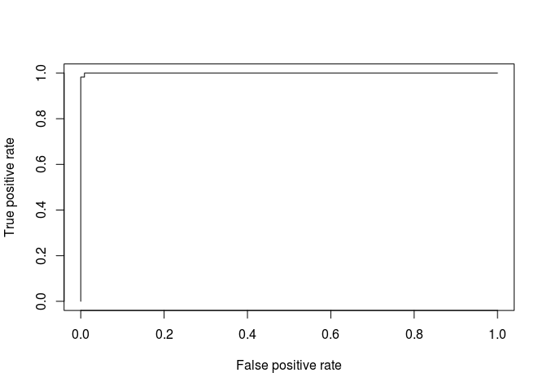
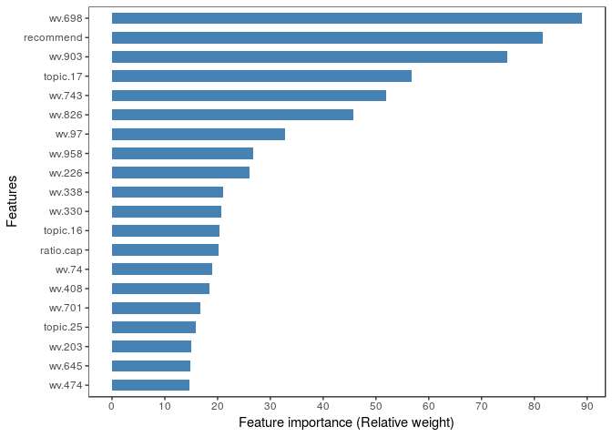

Predicting the Helpfulness of Racing Game Reviews on the Steam Store
====================================================================

### Mrinal Kanti Baowaly, TIGP Ph.D. Research Fellow, Academia Sinica, Taiwan.

Our goal:
---------

The goal of this research is to construct a model that can accurately
predict the helpfulness of game reviews. We can define our problem as
follows:

> Given a set of reviews, determine whether the reviews are helpful or
> not on the basis of review data, reviewer expertise and game
> information of those reviews.

Source code explanation:
------------------------

-   **feature\_ranking.R:** Models with a large number of features may
    cause issues, as irrelevant features may cause confusion, or
    unimportant features may increase the execution cost. Thus, we
    needed to select a proper subset of features, and that is why we
    should rank the features in our dataset by their importance. In this
    step, we employed the Random Forest algorithm as the Recursive
    Feature Elimination technique to output a sorted list of features by
    their importance. To rank the features, we employed 10-fold cross
    validation taking a (random) sample size 25%. We repeated the whole
    process 10 times and finally calculated the mean weight of each
    feature to rank them.

-   **gbm\_eval.R:** In our experiment, we employed a GBM (Gradient
    Boosting Machine) classifier for model training and evaluation.
    Before applying GBM to train the model, we investigated our dataset
    and found it imbalanced. To combat this imbalanced dataset, we
    applied a number of options discussed step by step in
    later sections.

-   **gbm\_nullModel.R:** For binary classification null model is built
    to compare the model performance. In our experiment, we to build up
    a null model we predict all observation to majority class.

Model training and evaluation:
------------------------------

On the steam store there are many game genres e.g. action, racing,
survival, rpg etc. In this case, we are investigating the helpfulness of
Racing game genre. We have considered those reviews which have at least
50 votes. The following step by step explanation are from the script
**gbm\_eval.R.**

    #Define some variables
    genre <- "Racing"
    vote_num <- 50

### 1. Load dataset

    #load dataset 
    dataFile <- paste0("Dataset/Reviews_", genre ,"_50.Rdata")
    if(!file.exists(dataFile) || file.size(dataFile) == 0){
      stop("Data file doesn't exist")
    }
    load(dataFile)
    original_dataset <- ds.reviews

### 2. Summarize dataset

Now it is time to take a look at the data

    # dimensions of dataset
    dim(original_dataset)

    ## [1] 2251 2205

You should see 2251 reviews and 2205 attributes in the original dataset
of Racing genre.

### 3. Add target variable/column

Steam helpfulness (target variable) of a review is defined by the rating
score of that review. The rating score of a particular review is
computed as the following equation:

*S**c**o**r**e* = *N**y*/(*N**y* + *N**n*),
 where *N**y* represents the number of people who feel the
review is helpful (Yes votes) and *N**n* represents the
number of people feel the review is not helpful (No votes).

Now depending on a score threshold (0.90) we defined our target variable
helpful as follows:

    ##Add a helpful column
    score_thrsld <- 0.90
    original_dataset$helpful <- ifelse(original_dataset$ws.score > score_thrsld, "Yes", "No")
    original_dataset$helpful <- as.factor(original_dataset$helpful)
    dim.y <- "helpful"

### 4. Feature Selection

After doing the feature ranking (Rscript feature\_ranking.R), we have
total **1789** features that as shown in the following table. Some
insignificant features are removed during the ranking process.

<table style="width:100%;">
<colgroup>
<col width="13%" />
<col width="28%" />
<col width="57%" />
</colgroup>
<thead>
<tr class="header">
<th>Feature Type</th>
<th>Examples</th>
<th>Explanation</th>
</tr>
</thead>
<tbody>
<tr class="odd">
<td>Metadata (39)</td>
<td>e.g. recommend, days.interval, #words, #sentences</td>
<td>Text, Reviewer, Game metadata. Counting, Aggregating, Ratio variables</td>
</tr>
<tr class="even">
<td>LIWC (93)</td>
<td>liwc.* (e.g. liwc.Segment, liwc.WC, liwc.Analytic, liwc.Tone)</td>
<td>Linguistic Inquiry and Word Count (LIWC) reads a given text and counts the percentage of words that reflect different emotions, thinking styles, social concerns, and even parts of speech</td>
</tr>
<tr class="odd">
<td>TF-IDF (629)</td>
<td>tfidf.* (e.g. tfidf.die, tfidf.easy, tfidf.better, tfidf.bad)</td>
<td>Unigram term-weighting method used to extract features based on the word frequencies in the review and review corpus</td>
</tr>
<tr class="even">
<td>LDA (28)</td>
<td>topic.* (e.g. topic.1, topic.2, topic.3)</td>
<td>Topic based features induced from review corpus</td>
</tr>
<tr class="odd">
<td>Word2Vec (1000)</td>
<td>wv.* (e.g. wv.1, wv.2, wv.3, wv.4)</td>
<td>Word2vec, a group of related models that are used to produce word embeddings features from the text</td>
</tr>
</tbody>
</table>

    #Load feature file
    featureFile <- paste0("Features/FT_", genre, "_V", vote_num, "_R", score_thrsld,"_S25.Rdata")
    if(!file.exists(featureFile)){
      stop("\nFeature File Not Exists!!")
    }
    load(featureFile)

    #Total number of features
    max.dims <- NROW(feature.rank)
    print(max.dims)

    ## [1] 1789

    #Total feature list
    dim.x <- feature.rank[order(feature.rank$total)[1:max.dims],]$name

    #Exclude tfidf features, we found there are not important at all
    dim.x <- grep("^tfidf.*?", dim.x, value = TRUE,  invert = TRUE)
    dataset <- original_dataset[, c(dim.x, dim.y), with=F]
    #Peek at the Data   
    head(dataset[,1:5], 5)

    ##    recommend   topic.17     wv.613     wv.367     wv.638
    ## 1:         0 0.04912281 -0.0196526 0.00585691 0.00564988
    ## 2:         0 0.04204204 -0.0181740 0.00550578 0.00636852
    ## 3:         0 0.04301075 -0.0237652 0.00789483 0.01222250
    ## 4:         1 0.02873563 -0.0156660 0.00388676 0.01468580
    ## 5:         1 0.02487562 -0.0175165 0.00381155 0.00345860

We did an investigation with a smaller sample size (50% of the dataset)
taking the upper limit of feature size by 1000. The results are
displayed in the following Figure.

From the above plot of F-score againts number of feature, we can clearly
see that the best F-scores of the dataset were found when the number of
features were 840.

    #Select number of features
    gbm.dim <- 840
    #Selec the best subset of the total features
    gbm.dim.x <- dim.x[1:gbm.dim]

### 5. Balance the dataset

Let’s now take a look at the number of instances (rows) that belong to
each class and balance the dataset.

    #Total number of rows in the dataset
    n.rows <- NROW(dataset)
    #Class Distribution
    print(table(dataset$helpful))

    ## 
    ##   No  Yes 
    ## 2187   64

Creates possibly balanced samples by random over-sampling minority
examples, under-sampling majority examples or combination of over- and
under-sampling.

    #Balance data set with both over and under sampling
    n.samplePercent <- 100
    n.sampleSize <- ceiling(n.rows * n.samplePercent/100)
    balanced_data <- ovun.sample(helpful ~ ., data = dataset, method="both", p=0.5, N=n.sampleSize)$data
    print(table(balanced_data$helpful))

    ## 
    ##   No  Yes 
    ## 1148 1103

### 6. Partition training and test dataset

Partition dataset into training (80%) and test (20%).

    #Split dataset
    split <- 0.80
    trainIndex <- as.vector(createDataPartition(y=balanced_data$helpful, p=split, list=FALSE))

    #Get train data
    gbm.dataTrain <- balanced_data[trainIndex, c(gbm.dim.x,dim.y), ]
    dim(gbm.dataTrain)

    ## [1] 1802  841

    #Get test data
    gbm.dataTest <- balanced_data[-trainIndex, c(gbm.dim.x,dim.y), ]
    dim(gbm.dataTest)

    ## [1] 449 841

    #Split train data
    gbm.trainX <- gbm.dataTrain[, gbm.dim.x, ]
    gbm.trainY <- as.factor(gbm.dataTrain[, dim.y, ])
            
    #Split test data 
    gbm.testX <- gbm.dataTest[, gbm.dim.x, ]
    gbm.testY <- as.factor(gbm.dataTest[, dim.y, ])

### 7. Preprocess data

    #Remove columns with near zero variance
    nearZV <- nearZeroVar(gbm.trainX)
    if(length(nearZV) > 0){
        gbm.trainX <- gbm.trainX[, -nearZV]
        gbm.testX <- gbm.testX[, -nearZV]
    }

    #Preprocess training Data
    preObj <- preProcess(gbm.trainX, method = c("center", "scale"))
    gbm.trainX <- predict(preObj, gbm.trainX)
            
    #Preprocess test Data
    preObj <- preProcess(gbm.testX, method = c("center", "scale"))
    gbm.testX <- predict(preObj, gbm.testX)

### 8. Train and build the model

We will apply 10-fold crossvalidation to build the model. In our
experiment, we have used more reliable evaluation metrics: F-score and
AUC. We have employed a GBM (Gradient Boosting Machine) classifier.

    #Control parameters 
    gbm.fitControl = trainControl(method="repeatedcv", #small size -> repeatedcv
                                  number=10, #10-fold cv
                                  repeats=3,
                                  returnResamp = "final",
                                  selectionFunction = "best",
                                  classProbs=TRUE, 
                                  summaryFunction=twoClassSummary,
                                  allowParallel = TRUE)
    #Train the model
    gbmFit <- train(gbm.trainX, gbm.trainY, method="gbm", metric="ROC", trControl=gbm.fitControl, verbose=F)

### 9. Evaluate the model

    #Get evaluation score
    eval_score <- get_eval_score(gbmFit, gbm.trainX, gbm.trainY, gbm.testX, gbm.testY, score_thrsld, "GBM")
    #print(eval_score)

We conducted a series of executions (10 times) from the steps 5-8 in
model training and the testing process to make the results more
accurate. The evaluation results are saved in a file in the Evaluation
directory. The mean evaluation metrics are shown in the following table.

    scoreFile <- paste0("Evaluation/SCORE_", genre,"_V50_R0.9.Rdata")
    load(scoreFile)
    final_eval_score <- sapply(Filter(is.numeric, comb.score), mean)

<table>
<thead>
<tr class="header">
<th>Evaluation Metric</th>
<th>Training score</th>
<th>Test score</th>
</tr>
</thead>
<tbody>
<tr class="odd">
<td>Accuracy</td>
<td>1</td>
<td>0.989</td>
</tr>
<tr class="even">
<td>Precision</td>
<td>1</td>
<td>0.988</td>
</tr>
<tr class="odd">
<td>Recall</td>
<td>1</td>
<td>0.991</td>
</tr>
<tr class="even">
<td>F1-score</td>
<td>1</td>
<td>0.989</td>
</tr>
<tr class="odd">
<td>AUC</td>
<td>1</td>
<td>0.999</td>
</tr>
</tbody>
</table>

    #Plot AUC curve
    test.pred <- predict(gbmFit, gbm.testX, type="prob")
    test.ref <- gbm.testY
    predob <- prediction(test.pred$Yes, test.ref)
    perf <- performance(predob, "tpr", "fpr")
    plot(perf)

From the above evaluation result, we found our model performed very well
to classify whether the reviews were helpful or not. All evaluation
metrics are about 99% for test dataset.

### 10. Model Validation: Compare with the null model

One way of validating our model is to compare the model with the null
model. We have a seperate script **gbm\_nullModel.R**. By executing this
file we have the following resrults. Remember that in null model, all
observations are predicted as the major class. In our case it is No.

    #Confusion matrix of the null model from training dataset
    null.cmTrain <- as.table(array(c(1750, 0, 52, 0),dim=c(2,2), dimnames=list(c("No","Yes"),c("No","Yes"))))
    names(attributes(null.cmTrain)$dimnames) <- c("Reference","Prediction")
    print(null.cmTrain)

    ##          Prediction
    ## Reference   No  Yes
    ##       No  1750   52
    ##       Yes    0    0

    #Confusion matrix of the null model from test dataset
    null.cmTest <- as.table(array(c(437, 0, 12, 0),dim=c(2,2), dimnames=list(c("No","Yes"),c("No","Yes"))))
    names(attributes(null.cmTest)$dimnames) <- c("Reference","Prediction")
    print(null.cmTest)

    ##          Prediction
    ## Reference  No Yes
    ##       No  437  12
    ##       Yes   0   0

<table>
<thead>
<tr class="header">
<th>Evaluation Metric</th>
<th>Our model</th>
<th>Null model</th>
</tr>
</thead>
<tbody>
<tr class="odd">
<td>Training Accuracy</td>
<td>1</td>
<td>0.971</td>
</tr>
<tr class="even">
<td>Test Accuracy</td>
<td>0.989</td>
<td>0.973</td>
</tr>
</tbody>
</table>

From the above table, we can see that our model performed better than
the null model.

### 11. What makes review helpful

    #Important features
    gbmImp <- varImp(gbmFit, scale = TRUE)
    impFeatures <- gbmImp$importance

    #Sort by overall weight
    impFeatures <- impFeatures[order(-impFeatures$Overall), , drop = FALSE]
    head(impFeatures, 10)

    ##                  Overall
    ## wv.826         100.00000
    ## wv.698          88.51781
    ## recommend       82.69755
    ## wv.645          63.75691
    ## wv.903          55.46920
    ## wv.743          30.16054
    ## wv.723          26.60150
    ## ratio.cap.root  26.34137
    ## wv.190          26.02646
    ## topic.15        25.81610

Similar to the evaluation metrics, feature importance is also computed
by averaging the weights of 10 executions and saved it in a file in the
ImpFeatures directory. The plotting of feature importace is shown as
follows.

    #Load feature importace file
    load(paste0("ImpFeatures/Imp_FT_", genre,"_V50_R0.9.Rdata"))

    #Select top 20
    top_features <- feature.imp[1:20, ]
    top_features$feature <- factor(top_features$feature, levels=unique(top_features$feature))
    featurePlot <- ggplot(data=top_features, aes(x=feature, y=mean )) +
      geom_bar(stat="identity", position=position_dodge(0.6), fill="steelblue", width=0.6) +
      scale_x_discrete(limits = rev(levels(top_features$feature))) +
      scale_y_continuous(breaks=c(seq(0,100,10))) +
      xlab("Features") + ylab("Feature importance (Relative weight)") + # Set axis labels
      theme_bw()+
      theme(panel.grid.major = element_blank(), panel.grid.minor = element_blank())

    #Horizontal bar plot
    featurePlot <- featurePlot + coord_flip()
    plot(featurePlot)

 We found
that review helpfulness mostly depends on metadata features and the
hidden word em-bedding features (Word2Vec).
